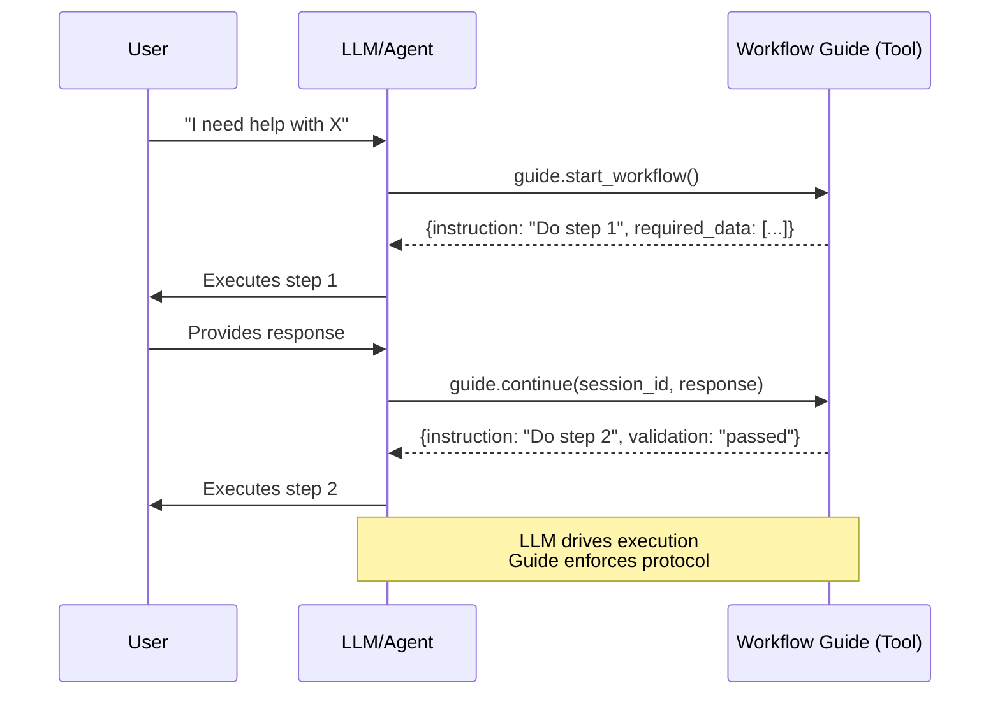
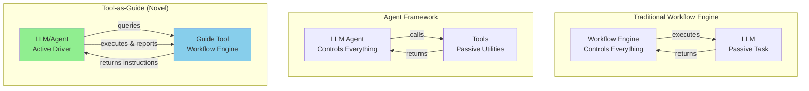

# Tool-as-Guide

> An architectural pattern for building reliable, auditable AI agents by separating workflow control from execution

[](https://opensource.org/licenses/MIT)

---

## 🎬 See It In Action

**[▶️ Watch: Pizza Ordering with Claude](examples/01-pizza-ordering/)** (60 sec) • **[▶️ Watch: Medical Triage Agent](examples/02-medical-triage/)** (15 sec)

### 🍕 Pizza Ordering - Chat Interface


**What you just saw:**
- User asks "what do you recommend?" → Claude explains each option with reasoning
- User says "pick something for me" → Claude intelligently selects and explains why
- Questions follow a strict order (crust → category → toppings → size)
- Natural, helpful conversation, but protocol-enforced

The guide controls the workflow. Claude provides the intelligence.

[Explore the code →](examples/01-pizza-ordering/)

---

### 🏥 Medical Triage - Autonomous Agent


**What you just saw:**
- Agent autonomously screens for emergency symptoms (protocol requirement)
- Checks medical history, classifies severity
- Makes escalation decision and saves audit trail
- All while the guide enforces clinical protocols

The guide ensures compliance. The agent does the work.

[Explore the code →](examples/02-medical-triage/)

---

## 🎯 The Problem

**Autonomous AI agents are powerful but unreliable for critical workflows:**

- ❌ Skip important steps
- ❌ Inconsistent behavior across runs  
- ❌ Hard to audit or debug
- ❌ Can't guarantee protocol compliance
- ❌ Unsuitable for regulated domains

**Current solutions don't solve this:**
- **Prompts**: Too fragile ("please follow these steps...")
- **Traditional workflows**: LLM is passive, no agency
- **Agent frameworks**: Too unpredictable for critical systems

---

## 💡 The Solution: Tool-as-Guide Pattern

> **TL;DR:** The Tool-as-Guide pattern is a workflow engine with inversion of control, acting as a protocol-driven supervisor for agentic systems.

### 🗺️ Think of It Like GPS Navigation

When you're driving through a city:
- **You're the intelligent, capable driver** - You navigate traffic, make decisions, handle unexpected situations
- **GPS provides turn-by-turn instructions** - Tells you which route to follow, which turn to take next
- **GPS doesn't drive for you** - But it ensures you don't miss critical turns or get lost

**Tool-as-Guide works the same way:**
- **Agent is the intelligent worker** - Capable of reasoning, adapting, executing tasks
- **Guide provides step-by-step instructions** - What to do next, what protocol to follow
- **Guide doesn't do the work** - But it ensures critical steps aren't skipped and protocols are followed

The agent stays intelligent and autonomous. The guide ensures reliability and compliance.

---

### How It Works in Practice

**Key insight:** The workflow engine is a *tool* that the LLM actively queries.



**The pattern in three points:**

1. **LLM/Agent has autonomy** - Drives conversation, executes tasks, makes decisions
2. **Guide provides instructions** - What to do next, what data is needed, what validates
3. **Protocol is enforced** - Can't skip steps, consistent behavior, auditable trail

### 🧠 The LLM Isn't Just Following Orders

**Important:** The LLM/Agent maintains its intelligence and flexibility:

- **Interprets user intent** - "I want something spicy" → translates to pepperoni/jalapeños
- **Generates natural responses** - Not just relaying template text
- **Handles unexpected input** - Clarifies, asks for details, adapts phrasing
- **Executes complex tasks** - Queries databases, calls APIs, processes data
- **Reasons within bounds** - Makes decisions at each step, guided by protocol

**The Guide enforces the protocol. The LLM provides the intelligence.**

It's like GPS: You're still the intelligent driver making decisions—GPS just ensures you don't miss critical turns.

### Code Example

Here's what the interaction looks like:

```python
# Agent queries the guide
response = guide.start_workflow()
# → {"instruction": "Ask user for pizza crust preference", 
#    "options": ["thin", "regular", "thick"], 
#    "required": true}

# Agent uses intelligence to interact with user
agent.ask_user("What kind of crust would you like? We have thin, regular, or thick.")
user_says("Make it crispy!")

# Agent interprets intent, sends to guide
response = guide.continue(session_id, "thin")
# → {"instruction": "Ask about toppings", 
#    "category": "vegetarian", ...}

# Guide controls WHAT steps. Agent controls HOW they're executed.
```

---

## 📊 Example Comparison

| Aspect | Pizza Ordering | Medical Triage |
|--------|---------------|----------------|
| **Interface** | Chat (Claude Desktop) | Autonomous Agent (Jupyter) |
| **Use Case** | Low stakes, conversational | High stakes, critical system |
| **AI Role** | Relays messages to user | Executes tasks autonomously |
| **Guide Role** | Returns prompts/questions | Returns tasks & protocol decisions |
| **Tools Used** | State machine only | State machine + DB + Classifier + Monitor |
| **LLM** | Claude (cloud) | Gemma (local, open) |
| **Domain Knowledge** | In guide (menu, options) | Separate classifier tool |
| **Purpose** | Show pattern basics | Show pattern for autonomous agents |
| **Audit Trail** | Session states | Full protocol compliance log |

**Both demonstrate the same core pattern in different contexts**, showing its versatility from simple chatbots to critical autonomous systems.

---

### The Architectural Inversion



**Tool-as-Guide** combines the best of both:
- ✅ Agent autonomy (LLM drives interaction)
- ✅ Workflow reliability (Guide enforces protocol)

---

## 🚀 Quick Start

Choose an example to explore:

### 🍕 [Pizza Ordering Example](examples/01-pizza-ordering/)
Chat interface demo with Claude Desktop or Cursor. Perfect for understanding the basics.

### 🏥 [Medical Triage Example](examples/02-medical-triage/)
Autonomous agent demo with Jupyter and local LLM. Shows the pattern for critical systems.

### 🔧 cursor-extend (Coming Soon)
> **⚠️ PREVIEW**: A tool that implements this pattern to help Cursor IDE generate workflow guides. Stay tuned!

Each example includes complete setup instructions and usage guide.

---

## 🏗️ Pattern Architecture

### Key Principles

1. **Separation of Concerns**
   - Guide: WHAT to do (workflow logic, validation, protocol)
   - Agent: HOW to do it (execution, reasoning, tool calls)

2. **Inversion of Control**
   - Agent queries the guide (not controlled by it)
   - Guide returns instructions (not commands)

3. **Stateful Sessions**
   - Each workflow has a unique session
   - State persists across interactions
   - Audit trail is automatic

4. **Deterministic Protocols**
   - Workflow logic lives in code
   - Same input → same workflow
   - Testable, verifiable, compliant

5. **Progressive Disclosure**
   - Agent receives only current instruction
   - Next steps revealed when needed
   - Reduces context window, improves focus

---

## 🌟 Use Cases

This pattern is particularly powerful for:

### Critical Systems
- 🏥 **Healthcare** - Enforce clinical protocols, emergency escalation
- 💰 **Finance** - Regulatory compliance, risk checks
- ⚖️ **Legal** - Document review checklists, thoroughness requirements

### Operational Workflows  
- 🚀 **Deployments** - Quality gates, approval workflows
- 🛡️ **Security** - Incident response protocols
- 📞 **Customer Support** - Troubleshooting procedures

### Any Domain Where:
- Protocol compliance is required
- Steps can't be skipped
- Behavior must be auditable
- Consistency matters more than flexibility

### Efficiency Benefits

Beyond reliability, this pattern also improves performance and reduces costs:

- **Smaller context windows**: Guide provides only the current instruction, not the entire workflow tree
- **Progressive disclosure**: Agent loads only what it needs at each step
- **Faster execution**: Deterministic protocol logic runs in the guide (not LLM inference)
- **Lower token costs**: Similar to Anthropic's [code execution research](https://www.anthropic.com/engineering/code-execution-with-mcp), processing logic outside the model reduces token consumption by 90%+

The guide acts as an efficient coordinator—the LLM only sees "what to do next," not "all possible paths."

---

## 🆚 How This Differs from Other Approaches

### 1. Prompt-Based Instructions (Fragile & Opaque)

Most LLM applications today rely on carefully crafted prompts ("think step by step...", "call tools as needed"). This approach is:

- **Brittle**: Minor prompt changes, model updates, or LLM randomness can produce different results
- **Opaque**: No clear audit trail—workflow logic is implicit in prompts and model reasoning
- **Unpredictable**: Can't guarantee every step will be followed in regulated processes

### 2. Traditional Workflow Engines (No LLM Intelligence)

Conventional workflow engines define steps externally but lack LLM adaptability:

- **Rigid**: The engine holds all logic—LLMs just fill in text generation
- **Limited Intelligence**: Little opportunity for adaptive reasoning
- **Separated**: Workflow and AI capabilities don't integrate well

### 3. Multi-Agent Supervision (Still Probabilistic)

Some architectures use supervising agents to check other agents' work. While this improves reliability:

- **Still LLM-driven**: Error correction is probabilistic, supervisors can miss violations
- **Weakly auditable**: Better than single-agent prompts, but no external testable flow
- **Complex**: Multiple LLMs increase cost and latency

### 4. Tool-as-Guide (Hybrid Approach)

The Tool-as-Guide pattern combines the strengths of both:

- **Deterministic Protocol**: Workflow state machine decides every step—LLM executes but doesn't decide
- **Context-Rich Guidance**: Tool provides detailed instructions, templates, and context for each step
- **True Auditability**: Code-based workflow with explicit state transitions
- **Debuggable**: Failures isolated to specific logic/data steps, not buried in prompts
- **LLM Intelligence**: Agent can still reason and adapt within the bounds of each step

**In essence:** The workflow is deterministic and auditable (like traditional engines), but the execution is intelligent and adaptive (like LLM agents).

---

## 🤝 Contributing

Feedback is appreciated! Open a PR or issue to discuss your ideas.

---

## 📜 License

MIT License

