# 🍕 Pizza Ordering Guide

A fun, approachable demonstration of the Tool-as-Guide pattern using Claude Desktop or Cursor.

## 🎬 Demo


*Watch how Claude uses the pizza ordering guide to walk through a complete order workflow. The guide controls every step - Claude executes and relays!*

## What This Demonstrates

A pizza ordering workflow where:
- **Guide controls**: Order of questions (crust → category → toppings → size → confirm)
- **Claude executes**: Natural conversation, understands responses, relays questions
- **Result**: Consistent ordering flow, can't skip steps, great UX

### Interaction Flow

```mermaid
sequenceDiagram
    participant User
    participant AI as AI Host (Claude/Cursor)
    participant Tool as Pizza Guide (State Machine)

    User->>AI: "I want to order a pizza"
    AI->>Tool: start_pizza_order()
    Tool->>Tool: Create session<br/>State: START → CHOOSE_CRUST
    Tool-->>AI: {session_id, prompt: "What crust?", instructions}
    AI->>User: "What kind of crust would you like?"
    
    User->>AI: "Thin crust"
    AI->>Tool: continue_pizza_order(session_id, "Thin crust")
    Tool->>Tool: Validate input<br/>Save crust="Thin"<br/>State: CHOOSE_CRUST → CHOOSE_CATEGORY
    Tool-->>AI: {prompt: "Vegetarian or meat?", next_state}
    AI->>User: "Vegetarian or meat?"
    
    User->>AI: "Vegetarian"
    AI->>Tool: continue_pizza_order(session_id, "Vegetarian")
    Tool->>Tool: Set category="vegetarian"<br/>Filter toppings list<br/>State: CHOOSE_CATEGORY → CHOOSE_TOPPINGS
    Tool-->>AI: {prompt: "Choose toppings: [Mushrooms, Olives...]"}
    AI->>User: "Choose from vegetarian toppings..."
    
    Note over User,Tool: Pattern continues through<br/>size selection and confirmation
    
    User->>AI: "Yes, confirm"
    AI->>Tool: continue_pizza_order(session_id, "yes")
    Tool->>Tool: State: CONFIRM → COMPLETE
    Tool-->>AI: {status: "complete", message: "Order confirmed!"}
    AI->>User: "🎉 Order confirmed! Ready in 20-30 mins"
```



**Key observation:** The Tool decides every step. The AI never chooses what to ask next - it only relays messages.

## Installation

### Prerequisites
- Python 3.10 or higher
- [uv](https://docs.astral.sh/uv/) (recommended) or pip

### Setup

```bash
# Clone or copy this directory
cd pizza-ordering

# Install dependencies
uv sync

# Or with pip
pip install -e .
```

## Usage

### Option 1: Use with Claude Desktop

1. **Edit your Claude Desktop config** at:
   - **macOS**: `~/Library/Application Support/Claude/claude_desktop_config.json`
   - **Windows**: `%APPDATA%\Claude\claude_desktop_config.json`
   - **Linux**: `~/.config/Claude/claude_desktop_config.json`

2. **Add the pizza ordering server:**

```json
{
  "mcpServers": {
    "pizza-ordering": {
      "command": "/absolute/path/to/uv",
      "args": [
        "--directory",
        "/absolute/path/to/pizza-ordering",
        "run",
        "server.py"
      ]
    }
  }
}
```

**Important:** Replace paths with actual absolute paths:
- **`command`**: Full path to `uv` (find it with `which uv` in terminal)
  - Common locations: `/Users/yourname/.local/bin/uv` or `/opt/homebrew/bin/uv`
- **`--directory`**: Full path to pizza-ordering folder (e.g., `/Users/yourname/pizza-ordering`)

> **Why full paths?** Claude Desktop doesn't inherit your shell's PATH, so you must use absolute paths for commands.

3. **Restart Claude Desktop**

4. **Start a conversation:**

```
You: I want to order a pizza
Claude: *Calls start_pizza_order()*
Claude: Great! Let's build your perfect pizza. What kind of crust would you like?
       Options: Thin, Regular, Thick, Gluten-free
You: Thin crust
Claude: *Calls continue_pizza_order()*
Claude: Perfect! Thin crust it is. Would you like a vegetarian pizza or one with meat?
... conversation continues ...
```

---

### Option 2: Use with Cursor

1. **Add to your Cursor MCP config** (`~/.cursor/mcp.json` or project `.cursor/mcp.json`):

```json
{
  "mcpServers": {
    "pizza-ordering": {
      "command": "uv",
      "args": [
        "--directory",
        "/absolute/path/to/pizza-ordering",
        "run",
        "server.py"
      ]
    }
  }
}
```

2. **Restart Cursor**

3. **Start a conversation:**

```
You: I want to order a pizza
Cursor: *Calls start_pizza_order()*
Cursor: Great! Let's build your perfect pizza. What kind of crust would you like?
       Options: Thin, Regular, Thick, Gluten-free
You: Thin crust
Cursor: *Calls continue_pizza_order()*
Cursor: Perfect! Thin crust it is. Would you like a vegetarian pizza or one with meat?
... conversation continues ...
```

---

### Option 3: Run CLI Demo (No MCP Setup Required)

The easiest way to see the Tool-as-Guide pattern in action:

```bash
cd pizza-ordering
python3 demo.py
```

This runs an interactive demo showing how the state machine guides the conversation. No MCP configuration needed!

### Option 4: Test with FastMCP CLI

```bash
# Run the server
uv run server.py

# In another terminal, use fastmcp CLI
fastmcp dev server.py

# Or test directly
python -c "
from pizza_guide import PizzaOrderGuide
guide = PizzaOrderGuide()

# Start order
result = guide.start_order()
print(result['prompt'])

# Continue order
session_id = result['session_id']
result = guide.continue_order(session_id, 'thin crust')
print(result['prompt'])
"
```

## Architecture

### Files

- **`pizza_guide.py`** - Core state machine logic (the "Guide")
  - `PizzaOrderGuide` class manages the workflow
  - State machine with states: START → CHOOSE_CRUST → CHOOSE_CATEGORY → CHOOSE_TOPPINGS → CHOOSE_SIZE → CONFIRM → COMPLETE
  - Pure Python, no MCP dependencies (portable)

- **`server.py`** - FastMCP server (the MCP wrapper)
  - Exposes the guide as MCP tools
  - Thin wrapper around `PizzaOrderGuide`
  - Handles MCP protocol

- **`pyproject.toml`** - Dependencies and metadata

### State Machine Flow


**How it works at each state:**
1. 🔄 Tool receives user's response
2. ✅ Tool validates input
3. 💾 Tool updates order data
4. ➡️ Tool advances to next state
5. 💬 Tool returns next question

### Key Components

#### 1. Session Management

```python
sessions: Dict[str, PizzaOrder] = {}
```

Each order gets a unique session ID. State persists across multiple tool calls.

#### 2. State Machine Logic

```python
if order.state == "CHOOSE_CRUST":
    return self._handle_crust_choice(order, user_response)
elif order.state == "CHOOSE_CATEGORY":
    return self._handle_category_choice(order, user_response)
# ... etc
```

Each state has a handler that:
- Validates user input
- Updates order data
- Returns next prompt

#### 3. Return Format

Every tool call returns:
```python
{
    "status": "in_progress" | "complete" | "error" | "cancelled",
    "session_id": "abc123",
    "action": "ask_user" | "respond",
    "prompt": "Question for user",
    "next_state": "NEXT_STATE",
    "instructions_for_ai": "What the AI should do"
}
```

This tells the AI exactly what to do - no guessing.

## MCP Tools

### `start_pizza_order() -> dict`

Starts a new pizza order session.

**Returns:**
- `session_id`: Unique order identifier
- `prompt`: First question to ask user
- `instructions_for_ai`: What the AI should do

**Example:**
```python
{
    "status": "in_progress",
    "session_id": "a1b2c3d4",
    "action": "ask_user",
    "prompt": "What kind of crust would you like?\n\nOptions: Thin, Regular, Thick, Gluten-free",
    "instructions_for_ai": "Ask the user this exact question and wait for their response."
}
```

### `continue_pizza_order(session_id: str, user_response: str) -> dict`

Continue an existing order with user's response.

**Parameters:**
- `session_id`: From `start_pizza_order()`
- `user_response`: User's answer to the last question

**Returns:**
- `prompt`: Next question to ask (if order continues)
- `message`: Final message (if order completes)
- `next_state`: What state we're moving to
- `order_summary`: Full order details (at confirmation)

**Example:**
```python
{
    "status": "in_progress",
    "session_id": "a1b2c3d4",
    "action": "ask_user",
    "prompt": "Perfect! Thin crust it is. Would you like a vegetarian pizza or one with meat?",
    "next_state": "CHOOSE_CATEGORY"
}
```

### `get_order_status(session_id: str) -> dict`

Get current order status and details.

**Returns:**
- Current order state
- All collected information so far

### `cancel_pizza_order(session_id: str) -> dict`

Cancel an order and delete the session.

---

## Learn More

- **[Tool-as-Guide Pattern](../../README.md)** - Full pattern documentation, comparisons, and use cases
- **[Medical Triage Example](../02-medical-triage/)** - See the pattern with an autonomous agent

---

## License

MIT License

---

**Built with:** [FastMCP](https://gofastmcp.com) • Python 3.10+

