# 🏥 Medical Triage - Autonomous Agent

> **⚠️ DISCLAIMER**: This is a simplified demonstration for educational purposes only. Real medical systems require clinical expertise, regulatory approval, and extensive validation. This is NOT production medical software.

A demonstration of the Tool-as-Guide pattern using an autonomous agent to perform medical triage while following strict clinical protocols.

## 🎬 Demo


*Watch an autonomous agent perform medical triage following a clinical protocol. The guide enforces mandatory steps - the agent executes autonomously!*

## What This Demonstrates

A medical triage workflow where:
- **Guide controls**: Clinical protocol (red flags → history → vitals → assessment)
- **Agent executes**: Calls medical databases, queries records, processes data autonomously
- **Result**: Protocol-compliant triage, emergency escalation, full audit trail

### Interaction Flow

```mermaid
sequenceDiagram
    participant Patient
    participant Agent as Autonomous Agent
    participant Guide as Triage Guide (Protocol)
    participant Tools as Medical Tools (DB, Vitals)

    Patient->>Agent: "I have severe chest pain"
    Agent->>Guide: start_triage()
    Guide->>Guide: Create session<br/>State: START → RED_FLAG_SCREENING
    Guide-->>Agent: {task: "screen_red_flags", instructions: "Check for emergency symptoms"}
    
    Agent->>Tools: medical_db.check_conditions()
    Agent->>Tools: symptom_classifier.classify()
    Tools-->>Agent: Critical symptoms detected
    Agent->>Guide: continue_triage(session_id, report)
    Guide->>Guide: Protocol decision:<br/>RED FLAGS DETECTED<br/>State: EMERGENCY_ESCALATION
    Guide-->>Agent: {status: "emergency", triage_level: "Level 1", message: "..."}
    Agent->>Patient: 🚨 EMERGENCY: You need immediate medical attention...
    
    Note over Patient,Tools: All steps logged in audit trail
```



**Key observation:** The guide enforces the protocol. The agent can't skip red flag screening, can't decide triage levels—it must follow the clinical workflow.

---

## Installation

### Prerequisites

- Python 3.10+
- [Ollama](https://ollama.com) - Local LLM runtime

### Setup

```bash
# 1. Install Ollama
brew install ollama  # macOS
# or visit ollama.com for other platforms

# 2. Download Gemma model (~2GB)
ollama pull gemma:2b

# 3. Install Python dependencies
cd medical-triage

# Option A: Using uv (recommended - avoids conflicts)
uv venv
source .venv/bin/activate
uv pip install -r requirements.txt

# Option B: Using pip
pip install -r requirements.txt

# 4. Register the kernel with Jupyter (if using virtual environment)
python -m ipykernel install --user --name=medical-triage --display-name="Medical Triage (Python 3.11)"

# 5. Start Ollama server (in a separate terminal)
ollama serve
```

---

## Usage

### Run the Jupyter Notebook (Recommended)

```bash
# Start the notebook
jupyter notebook medical_triage_demo.ipynb
```

**Important:** When the notebook opens, select the **"Medical Triage (Python 3.11)"** kernel from the Kernel menu (Kernel → Change Kernel) to use the virtual environment with all dependencies.

Then execute cells one by one to see the agent-guide interaction.

---

## Demo Scenarios

The notebook includes three scenarios:

### Scenario 1: Emergency (Red Flags)
- **Symptoms**: Severe chest pain
- **Guide Action**: Immediate escalation
- **Triage Level**: Level 1 - Immediate
- **Result**: Emergency Department NOW

### Scenario 2: Urgent (Critical Vitals)
- **Symptoms**: Moderate chest pain
- **Vitals**: BP 180/110, HR 120 (critical)
- **Guide Action**: All protocol steps, then urgent escalation
- **Triage Level**: Level 2 - Emergency

### Scenario 3: Non-Urgent (Routine)
- **Symptoms**: Minor issue
- **Vitals**: Normal
- **Guide Action**: Complete triage, standard recommendation
- **Triage Level**: Level 5 - Non-urgent

---

## File Structure

```
medical-triage/
├── README.md                    # This file
├── requirements.txt             # Python dependencies
├── triage_guide.py              # Guide state machine (core pattern)
├── fake_tools.py                # Mock medical tools
└── medical_triage_demo.ipynb    # Interactive demo
```

---

## Key Components

### 1. Triage Guide (`triage_guide.py`)

The workflow controller - implements clinical protocol:

```python
class MedicalTriageGuide:
    """
    State machine that enforces medical triage protocol.
    
    States:
    - RED_FLAG_SCREENING (mandatory, can't skip)
    - CHIEF_COMPLAINT
    - MEDICAL_HISTORY  
    - VITAL_SIGNS (mandatory)
    - SEVERITY_ASSESSMENT
    - COMPLETE
    """
```

**Protocol enforcement:**
- Red flags screened first (always)
- Emergency escalation (if red flags detected)
- Vital signs required (mandatory step)
- Complete audit trail (every step logged)

### 2. Autonomous Agent (in notebook)

The execution engine - decides HOW to accomplish tasks:

```python
class SimpleMedicalAgent:
    def execute_task(self, task, instructions):
        """
        Agent autonomously:
        1. Interprets task
        2. Calls appropriate tools
        3. Processes results
        4. Reports back to guide
        """
```

**Agent autonomy:**
- Chooses which tools to call
- Decides how to query data
- Uses LLM for reasoning (optional)
- Compiles comprehensive reports

### 3. Fake Medical Tools (`fake_tools.py`)

Simulated medical systems:

```python
class MedicalDatabase:
    """Simulates patient records database"""
    def check_conditions(symptoms): ...

class VitalsMonitor:
    """Simulates vital signs monitoring"""
    def get_vitals(patient_id): ...
```

---

## State Machine Flow


**How it works at each state:**
1. 🔄 Agent reports findings to guide
2. ✅ Guide validates protocol compliance  
3. 🚨 Guide makes escalation decisions (if needed)
4. ➡️ Guide advances to next state
5. 💬 Guide returns next task to agent

**Key insight:** The agent autonomously executes tasks (calling medical DB, checking history, etc.), but the guide enforces the clinical protocol. The agent can't skip mandatory steps or override triage decisions.

---

## Troubleshooting

### "Ollama connection error"

```bash
# Make sure Ollama is running
ollama serve

# In another terminal
ollama list  # Check if gemma:2b is installed
```

### "Module not found"

```bash
# Install dependencies
pip install -r requirements.txt
```

### "Notebook not starting"

```bash
# Try reinstalling jupyter
pip install --upgrade jupyter notebook
jupyter notebook medical_triage_demo.ipynb
```

---

## Learn More

- **[Tool-as-Guide Pattern](../../README.md)** - Full pattern documentation, comparisons, and use cases
- **[Pizza Ordering Example](../01-pizza-ordering/)** - See the pattern with a chat interface

---

## License

MIT License

---

**Built to demonstrate reliable AI for critical systems** 🏥

